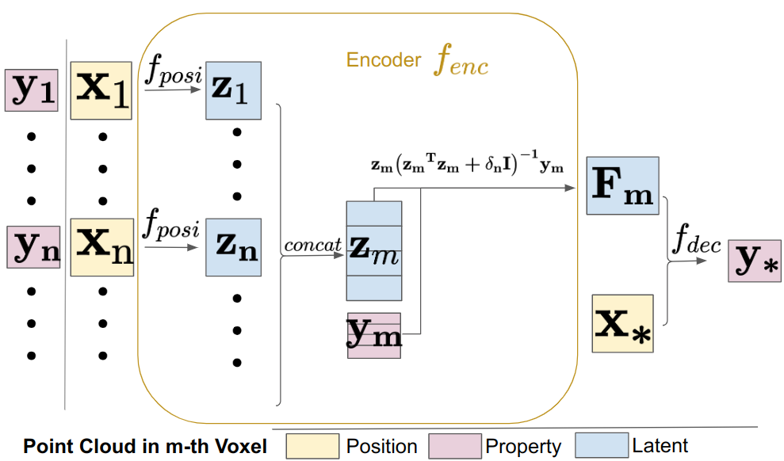
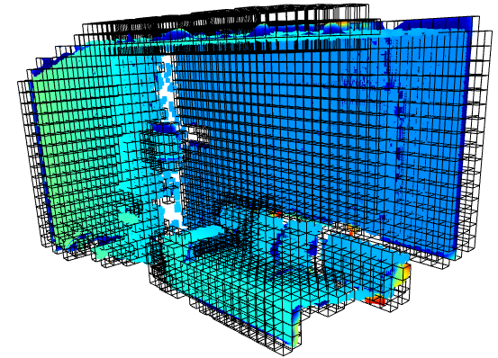
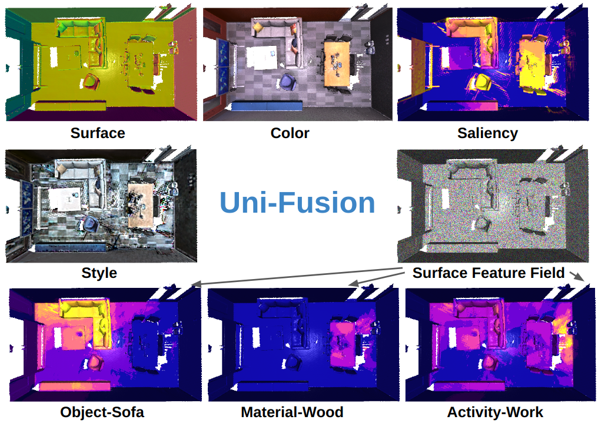

# [Uni-Fusion: Universal Continuous Mapping](https://jarrome.github.io/Uni-Fusion/)

[Yijun Yuan](https://jarrome.github.io/), [Andreas Nüchter](https://www.informatik.uni-wuerzburg.de/robotics/team/nuechter/)

[Preprint](https://arxiv.org/abs/2303.12678) |  [website](https://jarrome.github.io/Uni-Fusion/)

<p align="">
      
      
</p>

*Universal encoder **no need data train** | Voxel grid for mapping*

*Therefore, it supports **any mapping**:*

<p align="">

</p>

<!-- TABLE OF CONTENTS -->
<details open="open" style='padding: 10px; border-radius:5px 30px 30px 5px; border-style: solid; border-width: 1px;'>
  <summary>Table of Contents</summary>
  <ol>
    <li>
      <a href="#env-setting-and-install">Installation</a>
    </li>
    <li>
      <a href="#demo">Demo</a>
    </li>
    <li>
      <a href="#todo">TODO</a>
    </li>
    <li>
      <a href="#citation">Citation</a>
    </li>
    <li>
      <a href="#acknowledgement">Acknowledgement</a>
    </li>
  </ol>
</details>

#### Due to current working schedule, the toy-example and further release will be done by Chinese New Year 2024. ####

## Env setting and install
* Create env
```
conda create -n uni python=3.8
conda activate uni

conda install pytorch==1.12.1 torchvision==0.13.1 torchaudio==0.12.1 cudatoolkit=11.3 -c pytorch
pip install torch-scatter torch-sparse torch-geometric -f https://data.pyg.org/whl/torch-1.12.0+cu113.html
pip install ninja functorch==0.2.1 numba open3d opencv-python trimesh
```

* install package
```
git clone https://github.com/Jarrome/Uni-Fusion.git && cd Uni-Fusion
# install uni package
python setup.py install
# install cuda function, this may take several minutes, please use `top` or `ps` to check
python uni/ext/__init__.py
```

* train a uni encoder from nothing in 1 second
```
python uni/encoder/uni_encoder_v2.py
```


<details>
<summary> optionally, you can install the [ORB-SLAM2](https://github.com/Jarrome/Uni-Fusion-use-ORB-SLAM2) that we use for tracking</summary>
  
```
cd external
git clone https://github.com/Jarrome/Uni-Fusion-use-ORB-SLAM2
cd [this_folder]
# this_folder is the absolute path for the orbslam2
# Add ORB_SLAM2/lib to PYTHONPATH and LD_LIBRARY_PATH environment variables
# I suggest putting this in ~/.bashrc
export PYTHONPATH=$PYTHONPATH:[this_folder]/lib
export LD_LIBRARY_PATH=$LD_LIBRARY_PATH:[this_folder]/lib

./build.sh && ./build_python.sh
```
</details>

## Demo

All demo can be run with ```python demo.py [config]```

### 1. Reconstruction Demo 
```
# download replica data
source scripts/download_replica.sh

# with gt pose
python demo.py configs/replica/office0.yaml

# with slam
python demo.py configs/replica/office0_w_slam.yaml
```
* *in [scene_w_slam.yaml], we can choose 3 mode*

|Usage| load_gt| slam|
|---|---|---|
|use SLAM track|False|True|
|use SLAM pred pose|True|True|
|use GT pose|True|False|

* *you can set ```vis=True``` for online vis (```False``` by default), which is more Di-Fusion. You can tap keyboard ',' for step and '.' for continue running with GUI*

* *We will later provide a LIM_extraction given result LIMs*


### 2. Custom context Demo

[```office0_custom.yaml```](https://github.com/Jarrome/Uni-Fusion/blob/main/configs/replica/office0_custom.yaml) contains all mapping you need

```
# if you need saliency
pip install transparent-background
# if you need style
cd external
git clone https://github.com/Jarrome/PyTorch-Multi-Style-Transfer.git
cd PyTorch-Style-Transfer/experiments
bash models/download_model.sh

# run demo
python demo.py configs/replica/office0_custom.yaml
```

### 3. Open Vocabulary Scene Understanding Demo
This Text-Visual CLIP is from [OpenSeg](https://github.com/tensorflow/tpu/tree/641c1ac6e26ed788327b973582cbfa297d7d31e7/models/official/detection/projects/openseg)
```
# install requirements
pip install tensorflow
pip install git+https://github.com/openai/CLIP.git

# download openseg ckpt
gsutil cp -r gs://cloud-tpu-checkpoints/detection/projects/openseg/colab/exported_model ./external/openseg/

python demo.py configs/replica/office0_w_clip.yaml
```

### 4. Self-captured data
#### Azure capturing
We provide the script to extract RGB, D and IR from azure.mp4: [azure_process](https://github.com/Jarrome/azure_process)

---
## TODO:
- [x] Upload the uni-encoder src (Jan.3)
- [x] Upload the env script (Jan.4)
- [x] Upload the recon. application (By Jan.8)
- [x] Upload the used ORB-SLAM2 support (Jan.8)
- [x] Upload the azure process for RGB,D,IR (Jan.8)
- [x] Upload the seman. application (Jan.14)
- [x] Upload the Custom context demo (Jan.14)
- [ ] Toy example for fast essembling Uni-Fusion into custom project
- [ ] Extraction from Latent Implicit Maps (LIMs)
- [ ] Our current new project has a better option, I plan to replace this ORB-SLAM2 with that option after complete that work.

---
## Citation
If you find this work interesting, please cite us:
```bibtex
@article{yuan2024uni,
  title={Uni-Fusion: Universal Continuous Mapping},
  author={Yuan, Yijun and N{\"u}chter, Andreas},
  journal={IEEE Transactions on Robotics},
  year={2024},
  publisher={IEEE}
}
```

## Acknowledgement
* This implementation is on top of [DI-Fusion](https://github.com/huangjh-pub/di-fusion).
* We also borrow some dataset code from [NICE-SLAM](https://github.com/cvg/nice-slam).
* We thank the detailed response of questions from Kejie Li, Björn Michele, Songyou Peng and Golnaz Ghiasi.
